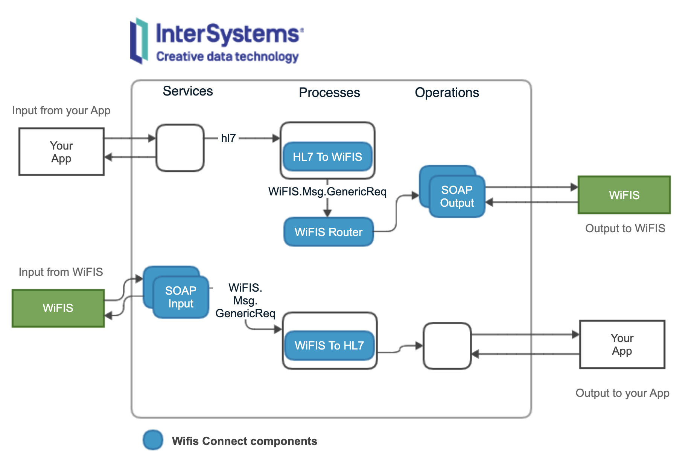

**WiFIS Connect** is an application you can install in [InterSystems Healthcare products](https://www.intersystems.com) to build your connection to [WiFIS](https://ticsalutsocial.cat/es/projectes/oficina-interoperabilidad/projecte-wifis/ "Work Flow para Instituciones de Salud") interoperability platform in [SISCAT](https://catsalut.gencat.cat/ca/coneix-catsalut/presentacio/model-sanitari-catala/siscat "Sistema Sanitario Integral de utilización pública de Cataluña").

# What is included?
*WiFIS Connect* includes components you can include in your interoperability production to connect your application to *WiFIS* platform.



# Quick Start
Run a quick test using a test docker environment and have a look at the examples. You can use [VSCode](https://code.visualstudio.com), see some [tutorials](https://comunidadintersystems.com/videotutoriales).

1. Dowloand the latest version:
```
git clone https://github.com/intersystems-ib/wifis-connect
```

2. Build and run the sample environment. This will run an [InterSystems IRIS For Health](https://www.intersystems.com/products/intersystems-iris-for-health/) with *WiFIS Connect* installed
```bash
docker-compose build
docker-compose up
```

You can access now to the [Management Portal](http://localhost:52773/csp/sys/UtilHome.csp) using `superuser`/ `SYS`.

3. Open an interactive session with IRIS
```bash
docker exec -it wifis-connect bash
iris session IRIS
```

4. Start sample production and enable SAML Ticket generation feature
```objectscript
zn "WIFISCONNECT"
do ##class(Ens.Director).StartProduction("WiFIS.V202.Test.ProdSAML")
do ##class(WiFIS.V202.Utils.Installer).ImportJavaHC3SA()
```

5. Send some sample messages. In the directory you downloaded the code, copy some files from [/samples](./samples) into [/samples/input](./samples/input)

6. See what's happened in the [Production](http://localhost:52773/csp/wifisconnect/EnsPortal.ProductionConfig.zen?PRODUCTION=WiFIS.V202.Test.ProdSAML&$NAMESPACE=WIFISCONNECT)

# Requirements
*WiFIS Connect* can be installed in:
  * InterSystems IRIS For Health
  * InterSystems Health Connect

You can still find deprecated releases [here](https://github.com/intersystems-ib/wifis-connect/releases).

# Installation
* Make sure you have [HealthCare HL7 XML](https://github.com/intersystems-ib/healthcare-hl7-xml) installed in your namespace.

* Download latest version into a temporary directory (e.g. /tmp):
```bash
git clone https://github.com/intersystems-ib/wifis-connect
```

* Load installer from an interactive session (terminal):
```objectscript
do $SYSTEM.OBJ.Load("/tmp/wifis-connect/src/WiFIS/V202/Utils/Installer.cls", "ck")
```

* Run installer:
```objectscript
do ##class(WiFIS.V202.Utils.Installer).Run("/tmp/wifis-connect")
```

For more complex installation options see [Dockerfile](./Dockerfile) example.

# Getting Started
* You can use and extend *WiFIS Connect* components.
* Do not modify or overwrite *WiFIS Connect* components (in other case, you probably won't be able to update).

## Message Basics
*WiFIS* is based on HL7 v.2.5 in XML version.

*WiFIS Easy Connect* use `MHS.3 / HD.2` content on each message to identify workflow and action.  

For instance, workflow *Derivacions* and action *DemanarNova*: 
```XML
<MSH.3>
  <HD.1>HOSPITAL</HD.1>
  <HD.2>#Derivacions#DemanarNova</HD.2>
</MSH.3>
```

## Sending Messages
When sending messages, you must implement some components for your application and the plug-in *WiFIS Connect* components.

### Output. Your app
* Your app will send data to a *Business Service* (TCP, SQL, SOAP, REST, etc.).
* Transform your app data into an HL7 message (*EnsLib.HL7.Message*) following WiFIS requirements. 
* Send the HL7 message you've created to the *WiFIS Connect* layer to deliver it to WIFIS.
  
### Output. WiFIS Connect
* WiFIS Connect will convert your HL7 message into a WiFIS HL7 v.2.5 XML.
* Then, it will determine which operation should send the message using a SOAP Business Operation. 
* Business Operation will deliver your message to WiFIS.

## Receiving Messages
In order to receive messages from WiFIS you can use *WiFIS Connect* components and connect them to some of your application components.

### Input. WiFIS Connect
* WiFIS Connect have a Business Service (SOAP) for each workflow that will receive messages from WiFIS.
* After receiving a message, *WiFIS Connect* will convert it an `EnsLib.HL7.Message` you can process.

### Input. Your application
* You receive the converted HL7 message and then you can transform it to whatever internal format you need.
* Finally, you can feed your processed message into your application through a Business Operation (SOAP, REST, SQL, HL7, etc.)

# Test Production
*WiFIS Connect* includes a sample production `WiFIS.V202.Test.Prod` to let you explore how you can use the package.

Main components are:

## Output to WiFIS
| Component | Description |
| --------- | ----------- |
| Leer HL7 ER7 File | Reads Files HL7 in ER7 format from a directory and sends them to *WiFIS Crear Msg* |
| Leer HL7 XML File | Reads Files HL7 in XML format from a directory and sends them to *WiFIS Crear Msg* |
| WiFIS Crear Msg | Receives an HL7 message, transforms it to XML and build a *WiFIS GenericReq*. Sends *WiFIS GenericReq* to *WiFIS Router*. |
| WiFIS Router | Receives a message *WiFIS GenericReq* and send it to the appropiate operation | 
| WiFIS X BO | Operation which is a WebService client and sends SOAP messages |

## Input from WiFIS
| Component | Description |
| --------- | ----------- |
| WIFIS.V.BS.X | WebService that receives WiFIS messages. Build a *WiFIS GenericReq* and sends it to *WiFIS ProcesarMsg*|
| WiFIS Procesar Msg | Receives a *WiFIS GenericReq*, transforms it to ER7 and sends it to *Escribir HL7 ER7 Fichero* and *Escribir HL7 XML Fichero*. |
| Escribir HL7 ER7 Fichero | Receives an `EnsLib.HL7.Message` and writes and HL7 file in ER7 format. |
| Escribir HL7 XML Fichero | Receives an `EnsLib.HL7.Message` and writes and HL7 file in XML format. |


# SAML Ticket
WiFIS requires a SAML ticket in the SOAP messages you send to the interoperability platform.

*WiFIS Connect* includes a utility to generate those SAML Tickets. You only need to set it up to use your own certificates.

You can find the sample production using the SAML feature in `WiFIS.V202.Test.ProdSAML`.

## Adding SAML ticket
*WiFIS Connect* generates the SAML ticket using an external Java *jar*:
* [hc3sa](./hc3sa) contains the jar that generates the SAML ticket.
* You need JDK8 installed in your server.
* You need to set up a [Java Gateway](https://docs.intersystems.com/irislatest/csp/docbook/DocBook.UI.Page.cls?KEY=AFL_javagateway) in your instance.
* You can use *Java Gateway* component in the `WiFIS.V202.Test.ProdSAML` as a starting point. Change the classpath as needed and JVM home as needed.

1. Import [hc3sa](./hc3sa) classes using your Java Gateway
```objectscript
// directory where you downloaded wifis-connect
set baseDir = "/tmp/wifis-connect" 
// the host of your gateway
set gatewayHost = "127.0.0.1"
// the port of your gateway
set gatewayPort = "55555"
write ##class(WiFIS.V202.Utils.Installer).ImportJavaHC3SA(baseDir, gatewayHost, gatewayPort)
```

2. Provided [hccsa.properties](./hc3sa/config/hccsa.properties) and [parameters.properties](hc3sa/config/parameters.properties) use an example certificate for test purposes. Modify those files to use your own certificates.

3. Use `WiFIS.V202.BO.SAMLjava` component in your production to generate the SAML Ticket. You can find a full working example on Quick Start section. 


---
**NOTE**

*This application is an open-source add-on for InterSystems HealthCare products and does not form part of the official release. InterSystems WRC technical assistance will not attend issues related with this application.*

---
